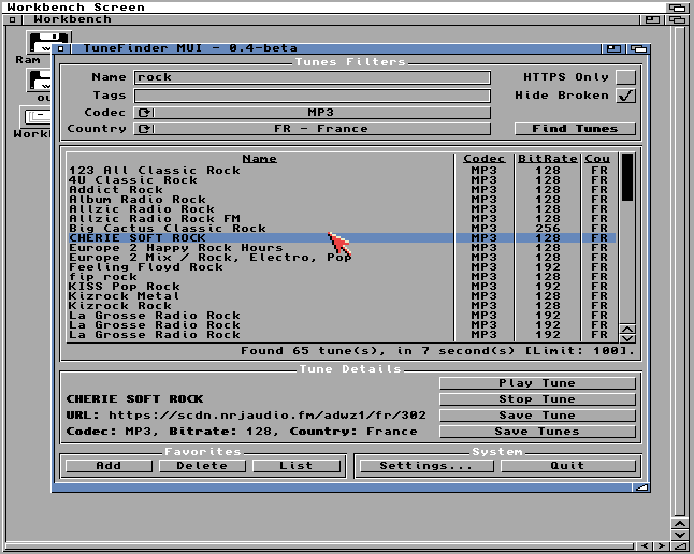

# TuneFinderMUI

TuneFinderMUI is a MUI-based Internet Radio browser for AmigaOS 3.x. For Intuition-based version check [TuneFinder](https://github.com/sandlbn/TuneFinder).

## Features

- Browse Internet radio stations using Radio Browser API
- Search by name, country, codec and tags
- Play stations directly in AmigaAMP
- Save favorite stations
- Export stations to PLS format
- Support for HTTPS streams
- Filter broken stations
- Configurable API settings

## Requirements

- AmigaOS 3.x
- MUI 3.8+
- AmigaAMP (for playback functionality)
- bsdsocket.library
- Working TCP/IP stack

## Installation

Run Install_TuneFinder script to install TuneFinderMUI to your system.

## Usage

- Use the search fields to find stations by name, country, codec or tags
- Double click a station or use the play button to start playback in AmigaAMP
- Use the Fav+ button to add stations to favorites
- Use the Save button to save stations as PLS files
- Access settings through Project -> Settings menu or System virtual group

## Configuration

Settings are stored in:
- ENVARC:TuneFinderMUI/apihost
- ENVARC:TuneFinderMUI/apiport
- ENVARC:TuneFinderMUI/countries.cfg
- ENVARC:TuneFinderMUI/favorites.cfg

## Features Comparison

TuneFinderMUI provides:
- Radio station browsing
- AmigaAMP integration
- Favorites management
- PLS export
- MUI-based interface
- Improved settings management
- Better visual feedback
- More configurable options

## Credits

- Interface design by Philippe Carpentier [@flype44](https://github.com/flype44)
- Icons design by Thomas Blatt
- Developed by [@sandlbn](https://github.com/sandlbn)

## License

Free to use and distribute